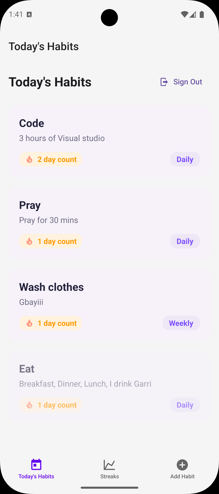

# Habit Application 🚀

Welcome to your Habit Tracker app built with [Expo](https://expo.dev) and React Native!  
This project helps users build and track habits, view streaks, and manage their progress with a clean, mobile-first interface.

---

## 📱 App Screenshots

<!-- screenshots of the app -->



---

## ✨ Features

- **Authentication:** Sign up and sign in with email and password.
- **Habit Management:** Add, view, and delete habits.
- **Streak Tracking:** See your current and best streaks for each habit.
- **Real-time Updates:** Habits and completions update in real time.
- **File-based Routing:** Uses Expo Router for navigation.
- **Responsive UI:** Built with React Native Paper for a modern look.
- **Cross-platform:** Works on Android, iOS, and web (with Expo Go).

---

## 🚀 Getting Started

1. **Install dependencies**

   ```bash
   npm install
   ```

2. **Start the app**

   ```bash
   npx expo start
   ```

   - Scan the QR code with [Expo Go](https://expo.dev/go) or run on an emulator/simulator.

---

## 🗂️ Project Structure

- **/app**: Main app source code (screens, navigation, logic)
- **/lib**: Shared utilities and context (e.g., `auth-context.tsx`)
- **/assets**: The images, and fonts used

---

## 🛠️ Development Notes

- **Authentication logic** is handled in `/app/auth.tsx` using a custom `useAuth` context.
- **RouteGuard** in `/app/_layout.tsx` protects routes and redirects based on authentication state.
- **Streak calculation** is implemented in `/app/(tabs)/streaks.tsx` and ranks habits by best streak.
- **CRLF line endings** are enforced via `.gitattributes` for Windows compatibility.
- **Real-time updates** use subscriptions to listen for habit and completion changes.


---

## 📚 Learn More

- [Expo documentation](https://docs.expo.dev/)
- [React Native Paper](https://callstack.github.io/react-native-paper/)
- [Expo Router](https://docs.expo.dev/router/introduction/)

---

## 💬 Community

- [Expo on GitHub](https://github.com/expo/expo)
- [Expo Discord](https://chat.expo.dev)

